# LearnNova
## AI-Powered Learning Assistant

LearnNova is a full-stack MERN application that transforms traditional study materials into an intelligent and interactive learning experience. Users can upload PDF documents, generate AI-powered summaries, create flashcards and quizzes, ask contextual questions, and track their learning progress,
all within a single platform.

---

## Overview

LearnNova was developed to simplify studying by integrating document management with Generative AI. Instead of manually reading lengthy PDFs and preparing revision material, users can interact with their documents through AI-powered summaries, concept explanations, flashcards, quizzes, and contextual chat.

The application is built using the MERN stack and Google Gemini API, providing a secure, scalable, and responsive learning platform.
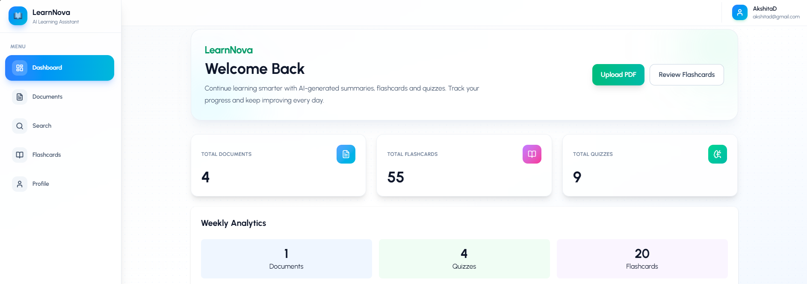

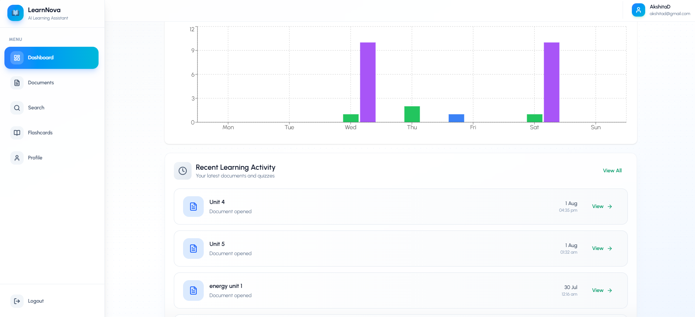

---

## Features

- Secure JWT Authentication
- PDF Upload & Document Management
- AI-Powered Document Chat
- Summary Generation
- Concept Explanation
- Automatic Flashcard Generation
- Quiz Generation
- Smart Document Search with Search Analytics
- Dashboard & Learning Progress Tracking
- User Profile Management

---

## Application Workflow

### 1. User Authentication

Users register or log in securely using JWT authentication.
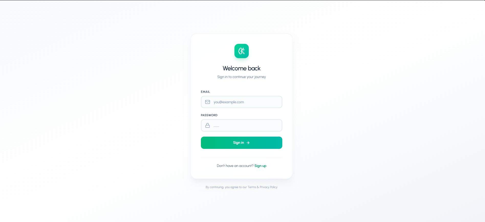

### 2. Document Upload

Users upload PDF documents through the Document Library. The backend validates the file, extracts its content using **pdf-parse**, and stores document information in MongoDB.
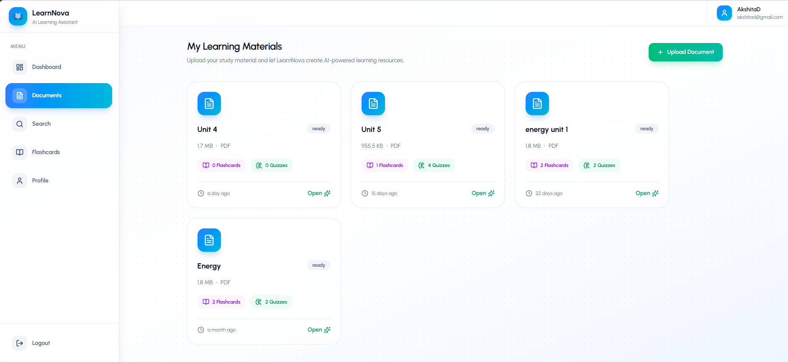

### 3. Smart Search & Analytics

Users can quickly search across uploaded documents using intelligent search capabilities.
The system tracks search activity and provides analytics including:

- Most searched documents
- Frequently searched keywords
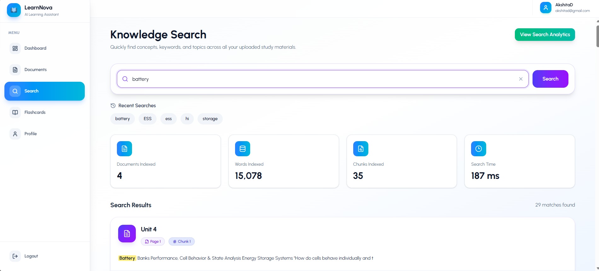
- Search history
- User search patterns
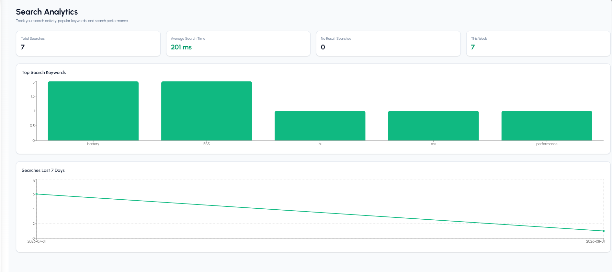

This helps users efficiently discover relevant learning material.

### 4. AI Processing

The extracted document content is processed by the **Google Gemini API**, which generates:

- Document Summaries
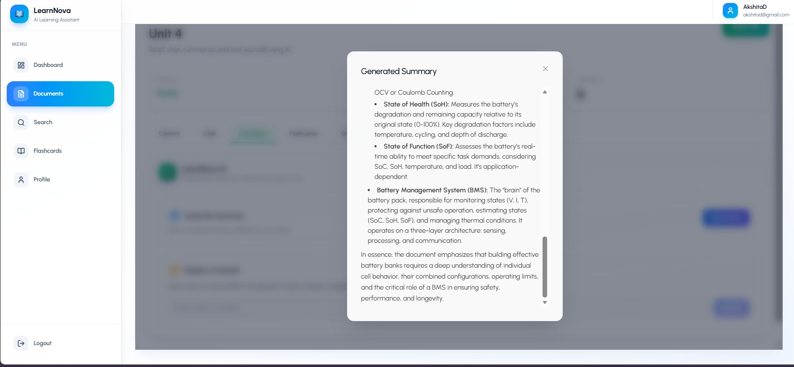
- Concept Explanations
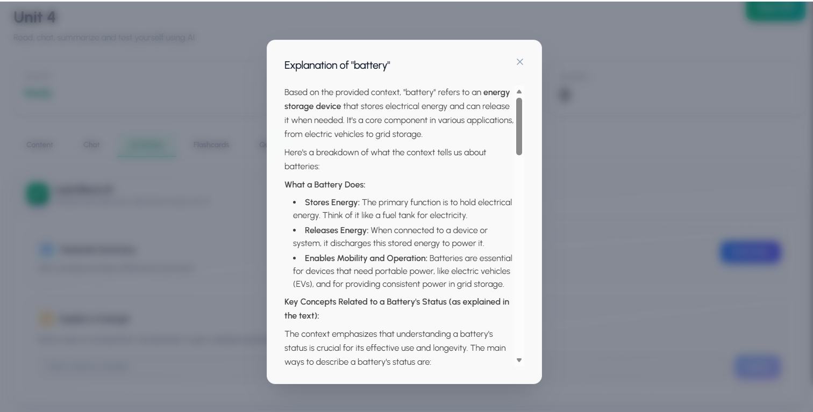
- Flashcards
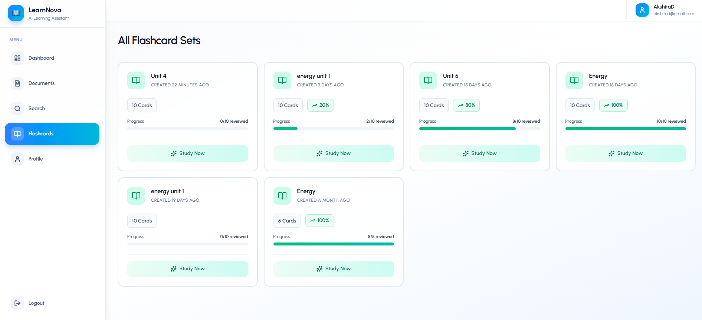
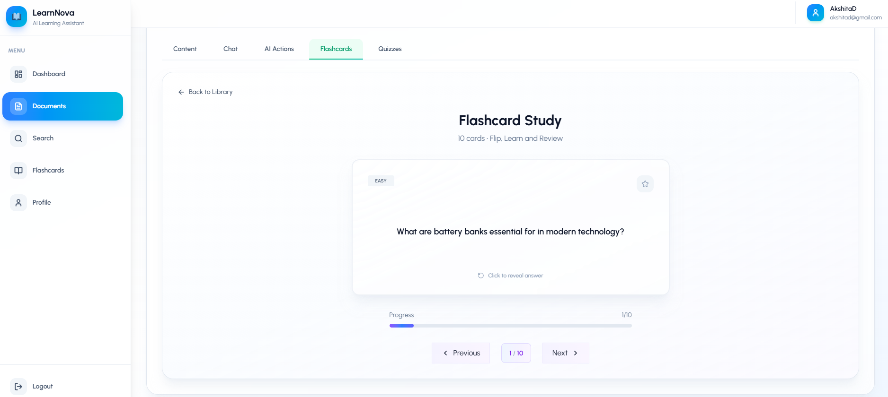
- Multiple Choice Quizzes
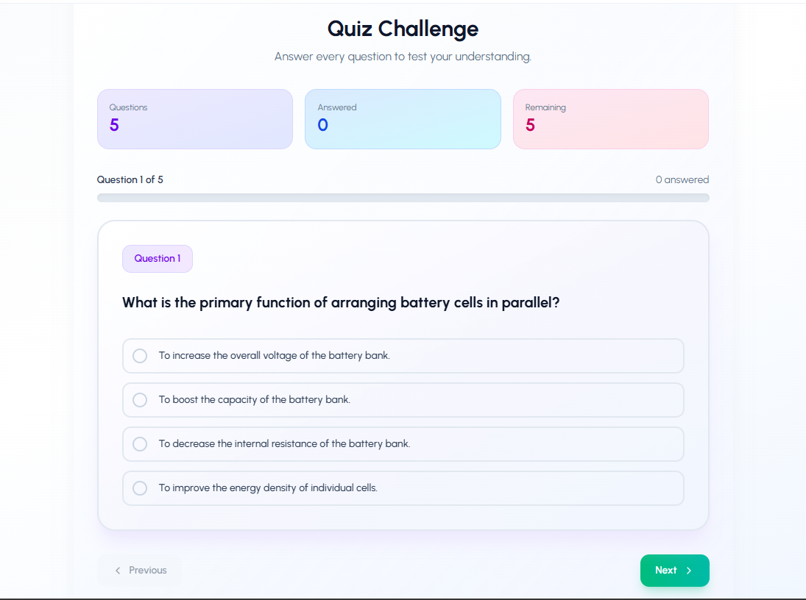
- Context-Aware Chat Responses
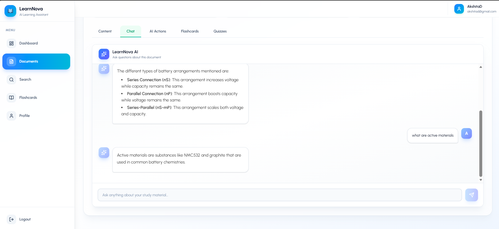

### 5. Data Storage

User information, uploaded documents, generated learning resources, quiz history, and progress data are stored securely in MongoDB.

### 6. Learning Dashboard

Users can access their uploaded documents, generated learning resources, quiz history, recent activity, and learning progress from a centralized dashboard.

---

## System Architecture
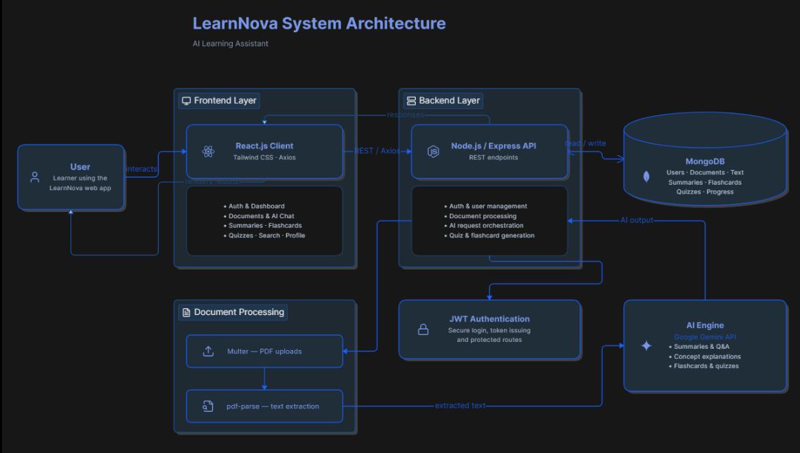


---

## Technology Stack

### Frontend

- React.js
- Tailwind CSS
- React Router
- Axios

### Backend

- Node.js
- Express.js
- JWT
- Multer
- pdf-parse

### Database

- MongoDB
- Mongoose

### AI

- Google Gemini API

---

## Installation

### Clone the repository

```bash
git clone https://github.com/aksitadabral/LearnNova.git
cd LearnNova
```

### Backend

```bash
cd backend
npm install
npm run dev
```

### Frontend

```bash
cd frontend
cd ai-learning-assistant
npm install
npm run dev
```

---

## Environment Variables

Create a `.env` file inside the `backend` directory.

```env
PORT=8000
MONGO_URI=your_mongodb_connection_string
JWT_SECRET=your_jwt_secret
JWT_EXPIRE=7d
NODE_ENV=development
MAX_FILE_SIZE=10485760
GEMINI_API_KEY=your_google_gemini_api_key
```

---


## Documentation

A detailed project report:

[LearnNova Project Documentation](/Documentation.pdf)


